# Luna

**YOUR AI ASSISTANT**

> A governed AI runtime for reliable execution, durable continuity, explicit verification, and controlled capability growth.

[](https://github.com/ASLM-Labs/Luna/actions/workflows/quality.yml)


---

## Intelligence with boundaries

Luna is built around a simple principle:

> **Intelligence may propose. Evidence, policy, and runtime state decide what becomes authoritative.**

Luna separates reasoning from authority, planning from execution, observations from evidence, and evidence from verified completion.

The system is designed to remain understandable as it grows: one authoritative root identity, explicit execution boundaries, durable runtime state, deterministic verification, and capability expansion that does not silently grant itself more power.

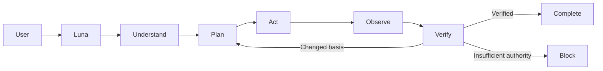

---

## What Luna is

Luna is not just a chat interface around a model. It is a **stateful AI execution system** that coordinates:

- task contracts and authoritative task state
- layered context composition
- planning and replanning
- model interaction and action resolution
- registered tools and safe workspace operations
- owned subprocess boundaries
- durable queues, checkpoints, and resume
- observations, evidence, and verification
- reviewed long-term memory
- desktop, Discord, voice, and CLI surfaces
- governed advanced-cognition research

The model participates in the system.

**It does not own the system.**

---

## Architecture

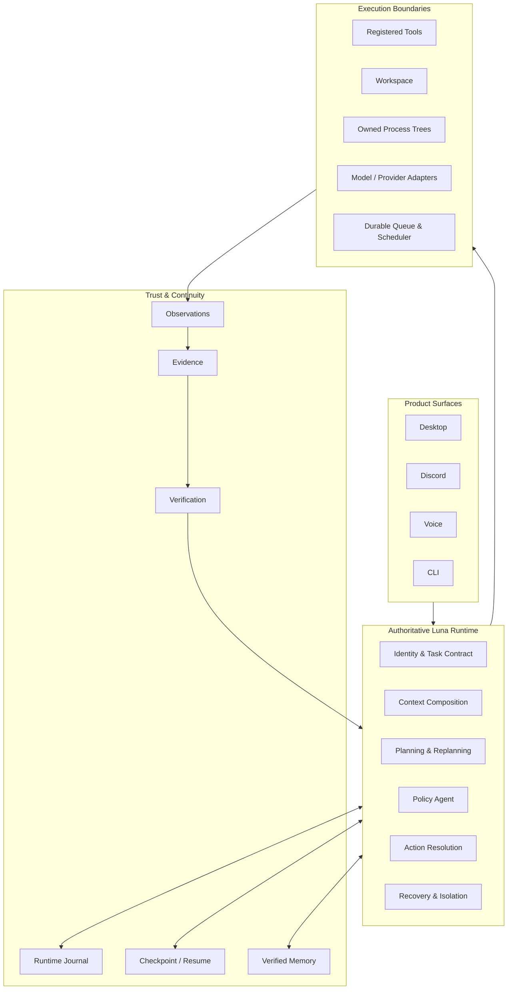

The key distinction is that **execution does not automatically imply truth**, and **model output does not automatically imply authority**.

---

## The authoritative runtime loop

Luna maintains one authoritative task state and advances it through an explicit action-observation-verification cycle.

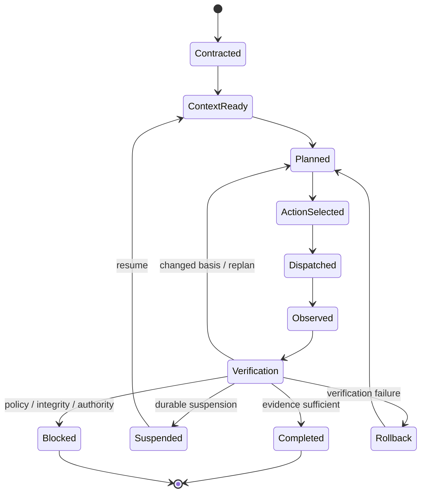

A tool call is therefore not the end of an operation. It is an observation-producing event inside a larger governed state machine.

---

## One Luna. One authority.

Luna is intentionally built around a **single authoritative voice**.

Models, memory, retrieval systems, tools, external evidence, and parallel workers may contribute information. None of them silently become equal authorities.

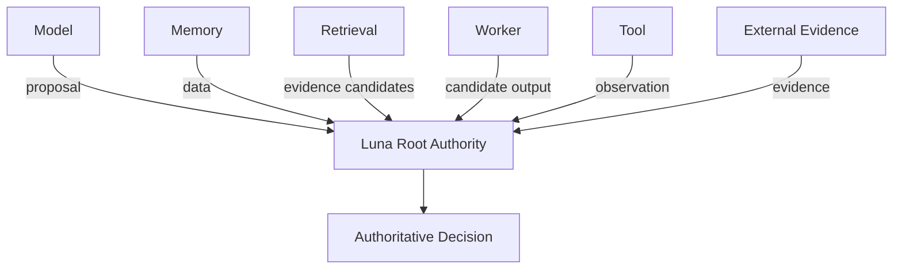

### Capability is not authority

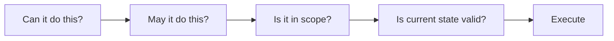

An implementation may technically support an operation while policy, scope, current state, or risk still forbids it.

---

## Context is structured, not dumped

Luna composes model-visible context through canonical layers with different control and trust semantics.

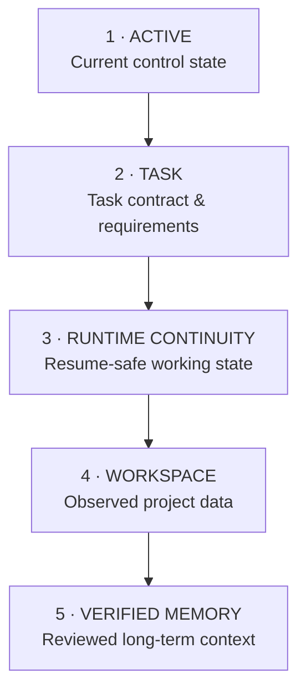

This design keeps several invariants explicit:

- active control state has priority
- passive data cannot escalate authority
- stale continuity can be rejected
- unverified memory does not become trusted context
- secrets can be removed before model exposure
- missing critical context remains visible instead of being invented

---

## Planning is not execution

A plan is an intention. An action must pass a separate resolution boundary before anything happens.

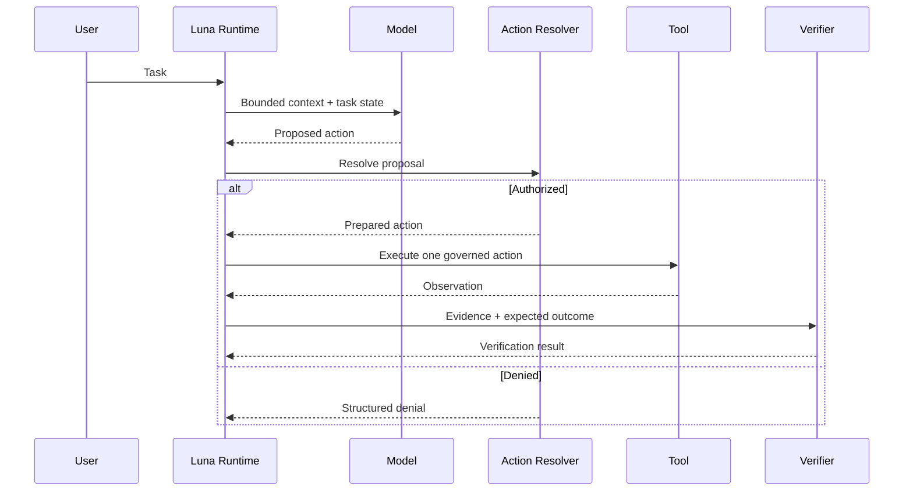

This prevents a model-generated tool call from becoming an implicit permission grant.

---

## Safe execution

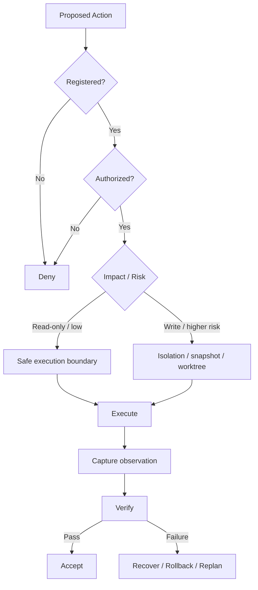

Luna's runtime foundations include exact-argv process execution, bounded output, explicit environments, process-tree ownership, workspace protection, rollback/recovery, scope checks, and governed side-effect handling.

---

## Evidence before completion

> **Successful execution and verified completion are different events.**

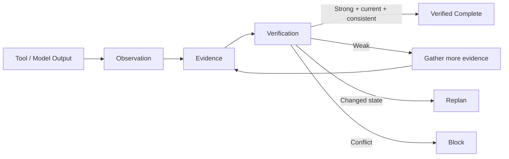

This prevents false completion from tool output alone, stale evidence, contradictory evidence, or unverified model confidence.

---

## Durable by design

Luna treats interruption and restart as normal runtime conditions.

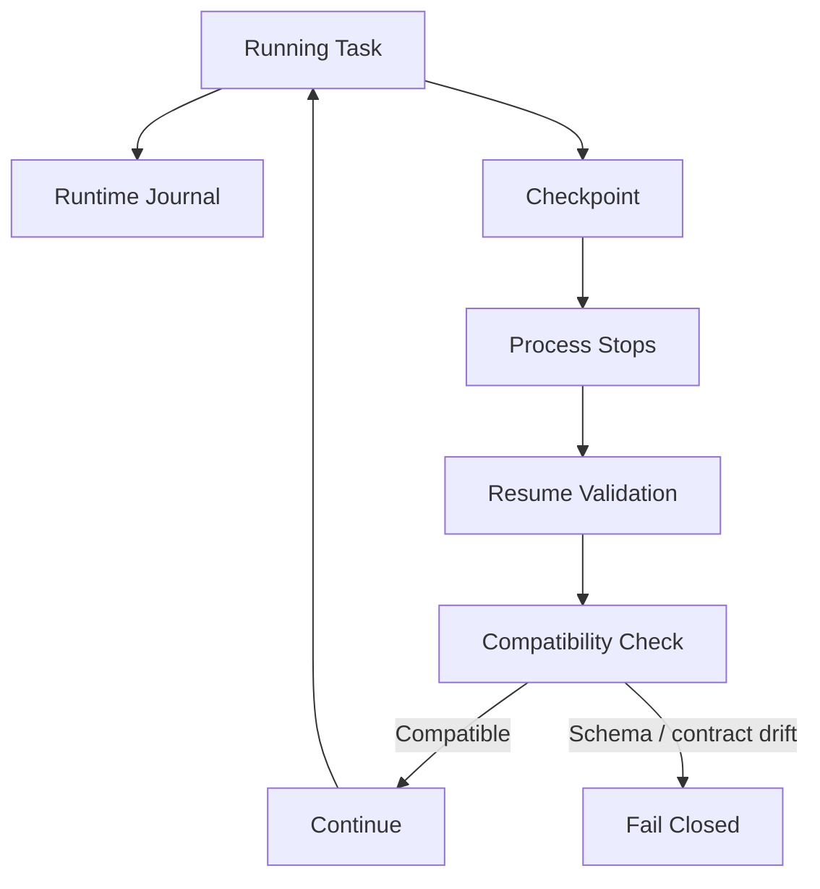

Continuity is protected through durable journals, checkpoint integrity, compatibility validation, replay fences, resumable state, and explicit suspend/cancel controls.

---

## Memory is reviewed knowledge

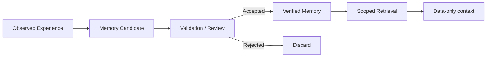

Long-term memory is intentionally separated from transient context. Provenance, verification state, confidence, scope, supersession, expiry, and forgetting remain explicit concerns.

---

## Recovery instead of blind retry

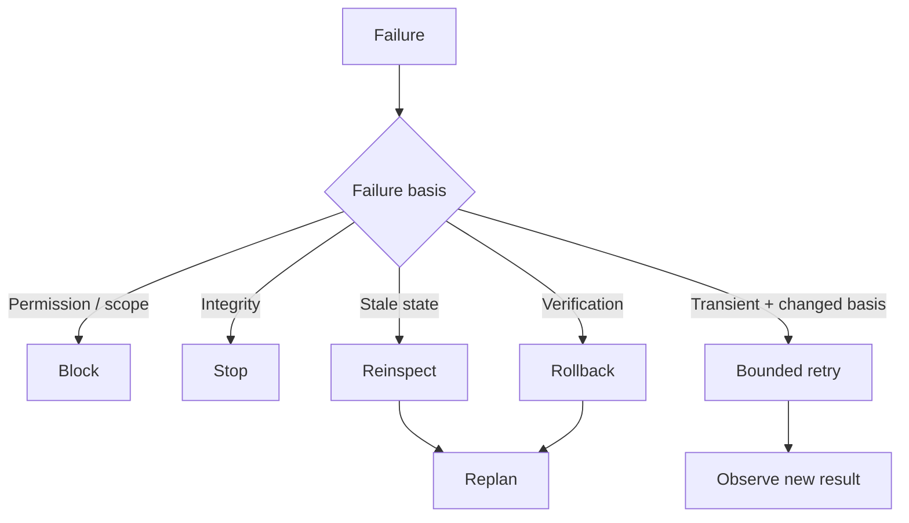

A failed action does not become more valid merely because it is attempted again. Retry state is bounded, evidence-aware, cancellable, and durable.

---

## C-011: parallel cognition without parallel authority

C-011 is Luna's governed parallel-cognition track. It explores bounded parallel cognition while preserving the single authoritative root identity.

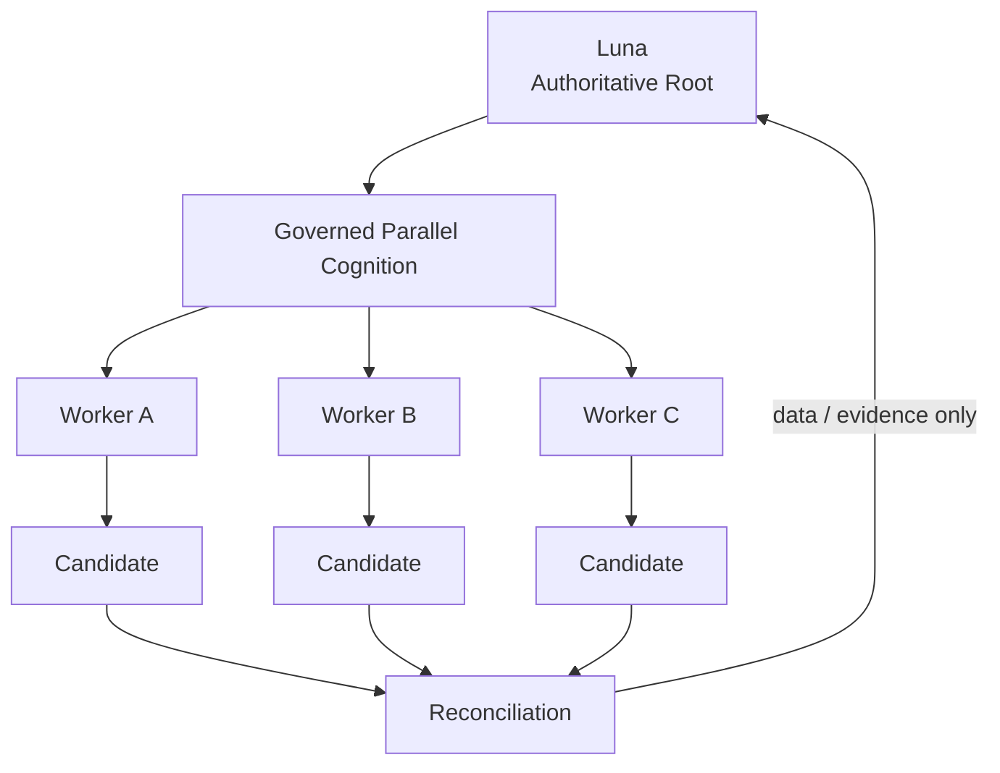

Workers do not receive root identity, completion authority, memory-commit authority, promotion authority, or unrestricted tool authority by default.

### Native isolation

Existing Common / Ultra native paths remain isolated from the C-011 ABI-v2 experimentation surface.

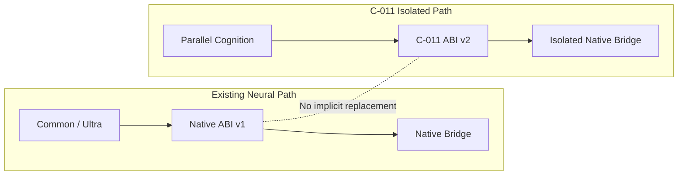

The separation is deliberate: advanced capability work should not silently replace previously verified execution paths.

---

## Product surfaces

The same governed runtime can sit behind multiple user-facing interfaces without fragmenting authority.

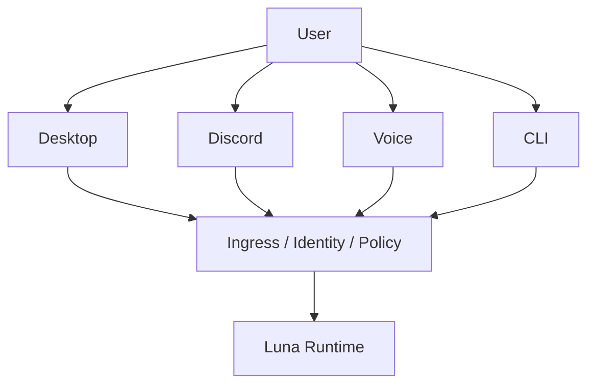

Product surfaces submit requests. They do not independently redefine identity, policy, evidence, or completion semantics.

---

## Research and learning governance

Luna contains foundations for controlled research, evaluation, learning-integrity, and candidate-improvement workflows.

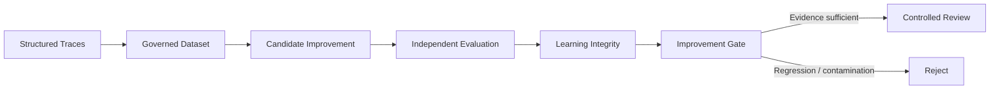

The architecture separates runtime execution, dataset preparation, evaluation, candidate training evidence, and promotion decisions. A candidate improvement cannot promote itself.

---

## System map

At a higher level, Luna can be viewed as four interacting systems.

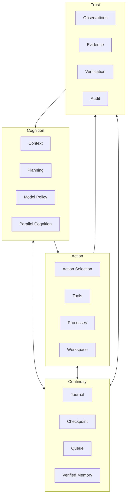

---

## Repository map

```text
Luna/
├─ src/luna/
│  ├─ actions/
│  ├─ context/
│  ├─ continuity/
│  ├─ modeling/
│  ├─ neural/
│  ├─ parallel_cognition/
│  ├─ planning/
│  ├─ recovery/
│  ├─ runtime/
│  ├─ shell/
│  ├─ tools/
│  ├─ verification/
│  └─ workspace/
├─ native/neural_bridge/
├─ scripts/
├─ tests/
├─ docs/
└─ .github/workflows/
```

Implementation, native boundaries, tests, verification scripts, and technical evidence are kept separate intentionally.

---

## Development

### Install

```bash
python -m pip install --upgrade pip setuptools
python -m pip install -e ".[dev]"
```

### Runtime checks

```bash
python -m luna --version
python -m luna status
```

### Test and static analysis

```bash
python -m pytest -q -p no:cacheprovider --basetemp=.pytest_tmp
python -m ruff check .
python -m mypy src
```

### Canonical Windows repository gate

```bat
scripts\check.bat
```

---

## Verification philosophy

Luna uses executable verification extensively.

Tests ask:

> Does this implementation behave correctly?

Capability and phase verifiers additionally ask:

> Does the repository still satisfy the architectural contract this capability was built under?

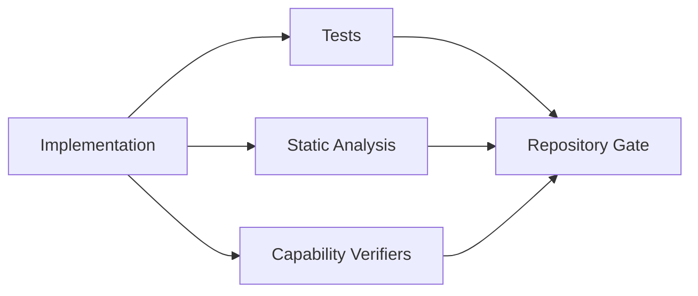

---

## Engineering principles

**Evidence over confidence.** A confident model output is not stronger than missing evidence.

**Explicit authority.** No model, tool, worker, memory item, or external source grants itself permission.

**Observe before infer.** Current observable state has priority over assumptions.

**Recover with changed basis.** Retry is not a substitute for new information.

**Durable state.** Important runtime transitions should survive process restarts.

**Isolation before impact.** Higher-risk operations require stronger execution boundaries.

**One authoritative identity.** Parallel work may increase cognition capacity without creating competing system identities.

**No false claims.** Unexecuted training, unverified results, unavailable capabilities, and incomplete evidence remain visibly incomplete.

---

## Current maturity

Luna is an actively developed AI runtime and research platform. The repository contains substantial foundations across runtime execution, continuity, memory, verification, product gateways, neural execution, and capability governance.

Some advanced paths remain deliberately constrained, experimental, default-off, or subject to further rollout work. That distinction is intentional.

Luna prefers **implemented over imagined, verified over assumed, and explicitly incomplete over falsely complete**.

---

## Technical history

The previous root README contained the detailed phase-by-phase implementation history, boundaries, smoke commands, and capability notes. It has been preserved rather than deleted:

**[Read the full phase and capability history →](docs/legacy/README_PHASE_HISTORY.md)**

---

## Luna

Luna is built around a question larger than *Can an AI perform this task?*

The more important questions are:

- Should it act?
- What does it actually know?
- What changed?
- What evidence supports the result?
- Can the result survive verification?
- Can the system resume safely tomorrow?

That is the foundation Luna is being built on.

**YOUR AI ASSISTANT**
